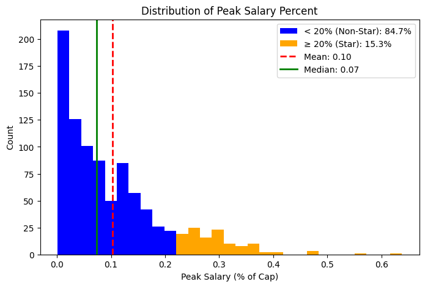
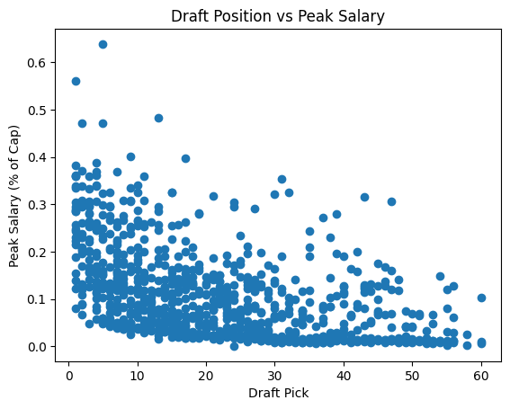
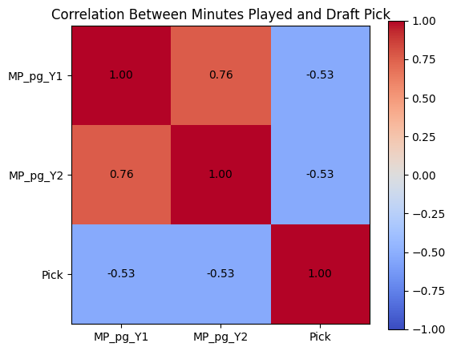
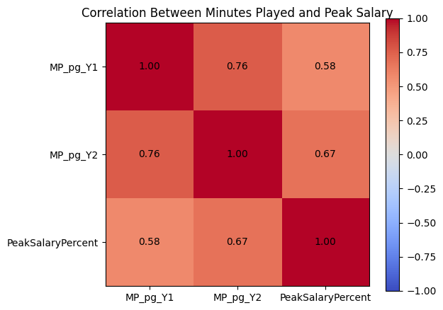
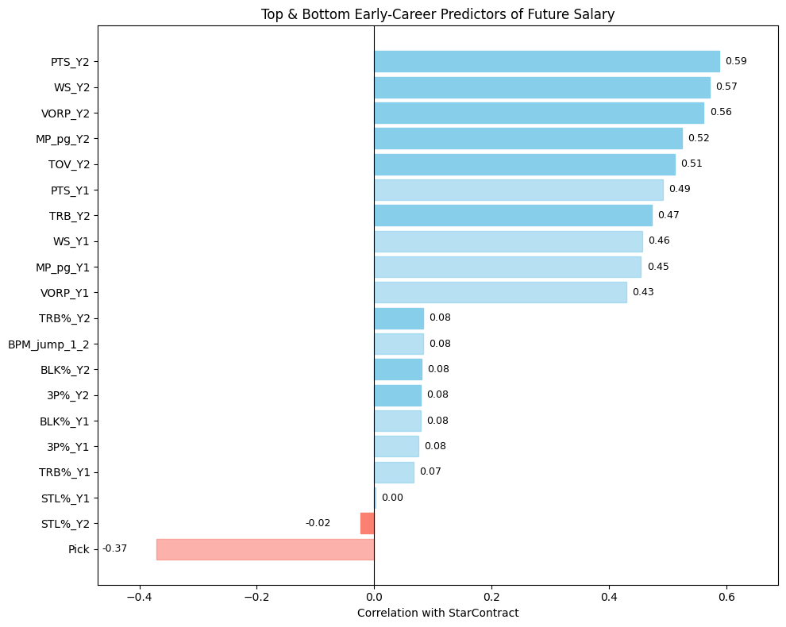
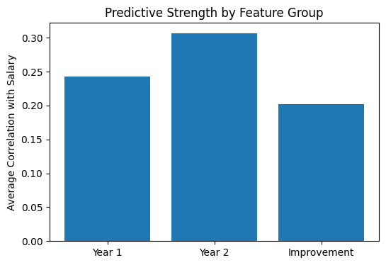

```{r xaringan-themer, include=FALSE, warning=FALSE}
library(xaringanthemer)
style_mono_light(
  base_color = "#1D428A",
  header_font_google = google_font("Stack Sans Headline"),
  text_font_google   = google_font("Stack Sans Text"),
  code_font_google   = google_font("Stack Sans Text"),
  base_font_size = "18px"
)
```
#Research Question: 

###Which early career performance factors lead to a "star-level" contract during a player's career?

- Hundreds of advanced stats and metrics exist to measure different aspects of player performance

- Can we use these to predict how high a player's contract value will peak?

---
# Data
<div style="text-align: center;">
  
  
</div>

<div style="clear: both;"></div>

- Advanced stats scraped from BasketballReference using Gabriel Pastorello's BRScraper tool

- Contract data scraped from BasketballReference by scraping every team-season page to extract player salaries, matching them to the list of players, and calculating each player's max salary

- 924 players drafted between 1991 and 2015 with ≥2 seasons played included

- Year 1 and Year 2 stats:
  - Advanced stats (TS%, eFG%, USG%, PER, VORP, BPM, WS, WS/48, TRB%, AST%, STL%, BLK%)
  - Per game stats (Points, Total Rebounds, Assists, Steals, Blocks)

---
# Salaries



- Player salaries represented as % of that season's salary cap to account for cap inflation

- Mean: 10% of the salary cap or ~$15.5 million under the current salary cap of $154.64 million

- Median: 7% of cap or ~$10.8 million currently

- We defined a "star-level" contract as one that is greater than 20% of the salary cap for the given year.

---
# Draft distribution



- As expected, the number of players who peaked with a "star contract" is higher at the beginning of the draft

- Two main reasons:
  - Players drafted higher tend to be better
  
  - Players drafted higher that don't perform as well tend to be given more time to develop, as the team's "commitment" to them is larger. 

---
# Playing Time



Moderate negative correlation between draft position and early-career playing time(r ≈ -0.53):
  - Negative values because lower draft pick = better
  - Higher draft picks receive more minutes to start
  - Higher expectations earlier on and increased opportunity on weaker teams

 

Stronger positive correlation between playing time and peak salary percentage
  - This is expected as players who make an immediate impact and play more in their earlier seasons tend to peak higher.
  - The increase between Year 1 and Year 2 is also expected as players who have a consistent role in their first season usually receive increased playing time in their second season. 
  
---
# Early Production and Role Drive Future Earnings



- Year 2 Production and opportunity metrics most important
  - Points, Win Shares, VORP, Minutes (r ≈ 0.52–0.59)

- Year 2 performance is more predictive than Year 1

- Efficiency metrics show weaker relationships
  - 3P% very low, eFG%, TS%, FT% all towards the middle

- Improvement metrics not showing much impact so far

- Draft position somewhat of a factor (r ≈ -0.37)

---
# Year 1 vs Year 2 vs Improvement



- Year 2 metrics are the most predictive
  - Average correlation: 0.31 vs 0.24 (Year 1) and 0.20 (Improvement)

- Year 1 performance still matters, but not as strong of a correlation

- Improvement metrics have limited predictive power
  - Growth is less important than overall production level
  
---
# Modeling

- Lasso/Ridge/PCA: R^2 of .47

- Classification Tree: R^2 of .886

- Gradient Boosting: R^2 of .891

- Random Forest: R^2 of .897

- Most influential variables across models: PTS_Y2, PER_Y2, MP_pg_Y2, VORP_Y2

- Initial models not very accurate, but later use of decision trees had a far higher accuracy, with Year 2 variables showing up frequently across all of those models
---
# Where the model fails

Some players achieve star-level contracts despite very low early-career Win Shares, revealing important limitations in models based only on early performance.

### What the data shows

- Several players with low average WS in first two seasons still reached high-value careers  
- Examples include late developers and role expanders  
- Early production does not fully capture long-term player value  

---
# Example players (Star Contracts with Low Early WS)

| Player | DraftYear | WS_Y1 | WS_Y2 | avg_WS_first2 | PeakSalaryPercent |
|--------|----------|-------|-------|---------------|-------------------|
| D'Angelo Russell | 2015 | 0.0 | 1.3 | 0.65 | 0.23 |
| Julius Randle | 2014 | -0.1 | 1.6 | 0.75 | 0.20 |
| Zach LaVine | 2014 | -0.7 | 2.6 | 0.95 | 0.28 |
| Khris Middleton | 2012 | 0.9 | 2.7 | 1.80 | 0.28 |
| DeAndre Jordan | 2008 | 1.3 | 1.5 | 1.40 | 0.21 |

---
## Interpretation

Early-career Win Shares alone fail to capture:
- player development trajectories  
- increased usage and opportunity  
- late-blooming performance growth  

These cases highlight systematic blind spots in purely early-performance-based salary prediction models.
- These 5 players are all at least 1x All-Stars and and two are champions
- All have played key roles for good teams, and if they had been given up on due to poor early career performance this wouldn't be the case.
---
# Key Takeaways so far

- Performance more predictive than improvement
  - Year 2 metrics (production + impact) are stronger predictors than growth or improvement alone
  
- Production & opportunity matter most
  - Points, WS, VORP, PER, and minutes most strongly correlated with future star-level contracts

- Draft position still influential
  - Early picks get more opportunity and larger contracts, after some control for performance

- Efficiency less predictive early
  - TS%, eFG%, 3P%, FT% show weaker correlation with star-level contracts in first two years
---
#Implications for Stakeholders

Primary Audience: NBA front offices

#### Early identification of future stars 
  - Helps teams recognize players on star trajectories before contract decisions
  - Can help identify undervalued players

#### Contributes to rookie extensions and longer-term financial planning
  - Predicting future player breakouts can help with salary planning in an era of the NBA where penalties for exceeding the salary cap can be harsh
  - Can reduce likelihood of overpaying players without "star-level" indicators

---
#Ethical/Societal Implications

#### Oversimplification of talent evaluation
  - Important traits like leadership, locker room value, and injuries aren’t captured in stats

#### Risk of missing out on late bloomers
  - Early improvement doesn't guarantee later career success, many players are late bloomers and this data only covers a player's first two years. 

#### Potential for bias
  - Historical biased contract trends might affect how the model treats certain players
  - Higher drafted players getting larger contracts, lack of appreciation for defensive specialists and stretch bigs. 
